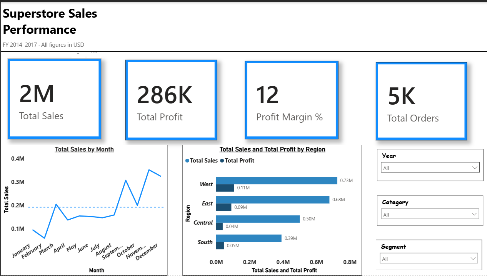
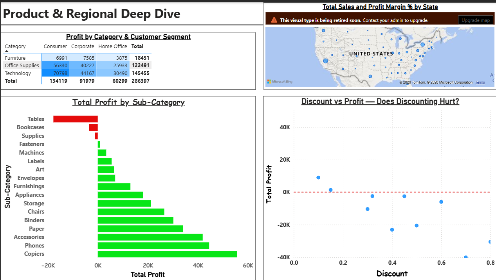

# 📊 Superstore Sales Performance Dashboard

> Analysing 9,994 retail transactions using SQL and Power BI to surface revenue trends, regional performance, product profitability, and the business impact of discounting.

## 🔗 Dashboard Preview

### Page 1 — Executive Overview


### Page 2 — Product & Regional Deep Dive


---

## 🎯 Business Questions Answered

| # | Question | Visual |
|---|---|---|
| Q1 | Which regions drive the most revenue and profit? | Regional bar chart (Page 1) |
| Q2 | Which product sub-categories are losing money? | Sub-category bar chart (Page 2) |
| Q3 | How has revenue trended month-over-month? | Monthly trend line (Page 1) |
| Q4 | Which customer segments generate the most value? | Category × Segment matrix (Page 2) |
| Q5 | Does heavy discounting hurt profitability? | Discount vs Profit scatter (Page 2) |

---

## 📊 Dataset

- **Source:** Superstore Sales Dataset — [Kaggle](https://www.kaggle.com/datasets/vivek468/superstore-dataset-final)
- **Size:** 9,994 orders · 21 columns · FY 2014–2017
- **Domain:** US retail — Furniture, Office Supplies, Technology

---

## 🔧 Approach

| Step | Details |
|---|---|
| SQL Analysis | 8 business queries using window functions, CTEs, GROUP BY, HAVING |
| Python EDA | Pandas + Seaborn — distributions, correlations, category breakdowns |
| Power BI Model | 6 DAX measures — Total Sales, Total Profit, Profit Margin %, Total Orders, Avg Order Value, YoY Growth |
| Dashboard | 2-page interactive report with cross-filtering slicers |

---

## 📈 Key Business Insights

**1. Discounting above 40% destroys profitability**
Orders with discount ≥ 0.4 consistently fall below zero profit — the scatter chart confirms discounting beyond this threshold generates losses, not revenue. Recommendation: cap discounts at 20%.

**2. Tables sub-category is the biggest profit drain**
Tables generate approximately $17,725 in total profit despite significant sales volume, making them the worst-performing sub-category by a wide margin. The high discount rate applied to Furniture drives this loss.

**3. West region leads in revenue, but South underperforms**
West generates $0.73M in sales (highest), while South generates only $0.39M. The central region has the lowest profit margin despite moderate sales volume, suggesting pricing or cost issues specific to that region.

**4. Technology is the highest-margin category**
Technology generates $145,455 in total profit across all segments — nearly equal to the combined profit of Furniture ($18,451) and Office Supplies ($122,491). Phones and Copiers are the standout sub-categories.

**5. Q4 seasonal spike is consistent across all years**
The monthly trend shows a clear spike every November–December across FY 2014–2017. Q4 consistently accounts for the highest monthly revenue, with October also showing a secondary peak. Recommendation: increase inventory and marketing investment ahead of Q4.

---

## 🗄️ SQL Analysis

Key queries in `analysis.sql`:

- Revenue and profit by region with margin %
- Top and bottom 5 sub-categories by profit
- Month-over-month sales with running total (window function)
- Profit by segment and category
- Discount band analysis (no discount / low / medium / high)
- Top 10 customers by revenue with RANK()
- Year-over-year growth by category using LAG()
- States with negative profit

---

## 📊 DAX Measures

```dax
Total Sales = SUM(superstore[Sales])

Total Profit = SUM(superstore[Profit])

Profit Margin % = DIVIDE(SUM(superstore[Profit]), SUM(superstore[Sales]), 0) * 100

Total Orders = DISTINCTCOUNT(superstore[Order ID])

Avg Order Value = DIVIDE([Total Sales], [Total Orders], 0)

YoY Sales Growth =
VAR CurrentYear = CALCULATE([Total Sales],
    YEAR(superstore[Order Date]) =
    MAXX(ALL(superstore), YEAR(superstore[Order Date])))
VAR PrevYear = CALCULATE([Total Sales],
    YEAR(superstore[Order Date]) =
    MAXX(ALL(superstore), YEAR(superstore[Order Date])) - 1)
RETURN DIVIDE(CurrentYear - PrevYear, PrevYear, 0) * 100
```

---

## 🛠️ Tech Stack

`SQL` · `Python` · `Pandas` · `Seaborn` · `Power BI` · `DAX`

---

## 📁 Repository Structure

```
superstore-sales-dashboard/
├── .gitignore
├── README.md
├── analysis.sql                    # 8 SQL business queries
├── Superstore_EDA.ipynb            # Python EDA notebook
├── Superstore_Sales_Dashboard.pdf  # Exported Power BI dashboard
├── page1_executive_overview.png    # Dashboard screenshot
└── page2_deep_dive.png             # Dashboard screenshot
```

---

## 📝 Limitations and Next Steps

- Dataset covers FY 2014–2017 only — trends may not reflect current market conditions
- Discount analysis is at the order level — customer-level discount impact would require additional modelling
- Adding a forecasting layer (Prophet or ARIMA) on the monthly trend could predict Q4 revenue more precisely
- A customer segmentation analysis (RFM) would complement the segment-level matrix insight
